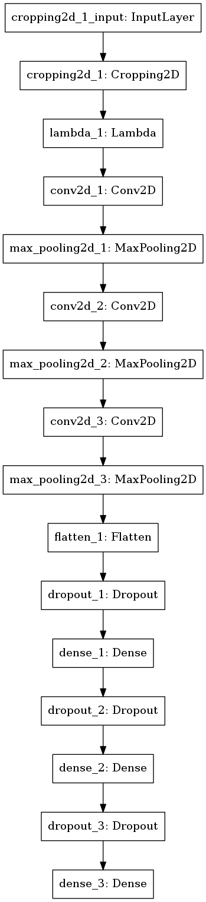

**Behavioral Cloning Project**
---
The goals of this project are the following:
* Use the simulator to collect data of good driving behavior
* Build, a convolution neural network in Keras that predicts steering angles from images
* Train and validate the model with a training and validation set
* Test that the model successfully drives around track one without leaving the road
* Summarize the results with a written report

---

### Model Architecture

The model architecture is illustrated in the following table:

| Layer (type)         |       Output Shape            |  Param #                        |
|:----------------------:|:-------------------------------:|:------------------------------:|
| Cropping2D         |   80 x 320 x 3 |   0                             |
| Lambda  |          80 x 320 x 3  |   0 |
| Conv2D (RELU activation) 5x5   |         76 x 316 x 16 |      1216 |
| MaxPooling 4x4 | 19 x 79 x 16  |  0 |
| Conv2D (RELU activation) 5x5 |          15 x 75 x 24   |     9624 | 
| MaxPooling 2x2 | 8 x 38 x 24   |      0 |
| Conv2D (RELU activation) 3x3 |  6 x 36 x 32  |    6944 |
| MaxPooling 4x4 | 2 x 9 x 32)  |        0| 
|Flatten     |     576    |       0 |
| Dropout (0.25) |     576  |               0|
| Dense       |       500  |              288500|
| Dropout (0.25) |        500 |                0 |
| Dense    |          100  |             50100 |
| Dropout (0.5) |       100 |              0 |
| Dense       |     1      |           101 |

Total parameters: 356,485.

---
The model is composed by: 

- a cropping layer to trim off the region of interest of the image(i.e., the road lane lines) 

- a Lambda layer for data normalization. 

- three convolutional layers followed by RELU activation functions are implemented to extract the road features. 

- three dense layers followed by dropout regularization are used to estimate the steering angle.  

- three dropout layers, each one after the dense layers, to avoid overfitting.

- adam optimizer was used , so the learning rate was not tuned manually.

A brief visual description of the model can be seen in the following picture:

### Model Training Strategy

My first attempt was to go with the NVIDIA model given as reference in the link [NVIDIA paper](http://images.nvidia.com/content/tegra/automotive/images/2016/solutions/pdf/end-to-end-dl-using-px.pdf)  but I found it as beeing overkill for our task so I went for a custom DNN.

After some training and validation and some kernel sizes chossing, this model had the lowest mean square error on the training and validation sets. 

The model works fine on all three difficult sections of the track: 
- bridge(different texture) 
- dirt part of the track( a lot of lateral corrections and sharp turns) 
- right turns(since the circuit is counterclockwise we have a lot of left turns). It was a surprize to me to see it had performed even better than a model with augmented data(mirrored images).
 

#### Creation of the Training & Validation datasets

The dataset was generated using the data found inside the ./data/IMG folder since I found out during tests in training simulator mode that I'am a terrible driver :)

I have created a helper function `check_image` to detect if the images are of type `None` or empty size.

The images have been converted from BGR to RGB for the neuronal network to be used using OpenCv library function `cv2.cvtColor`

The dataset has been shuffled and then split into a training set (80%) and a validation set (20%). 

A generator function is used to load batches of the sets iteratively to avoid excesive use of memory during the training and validation processes.

The validation set helped determine if the model was over or under fitting. The ideal number of epochs was 3 as evidenced by low change in the final loss value. 

I used an adam optimizer so that manually training the learning rate wasn't necessary.
